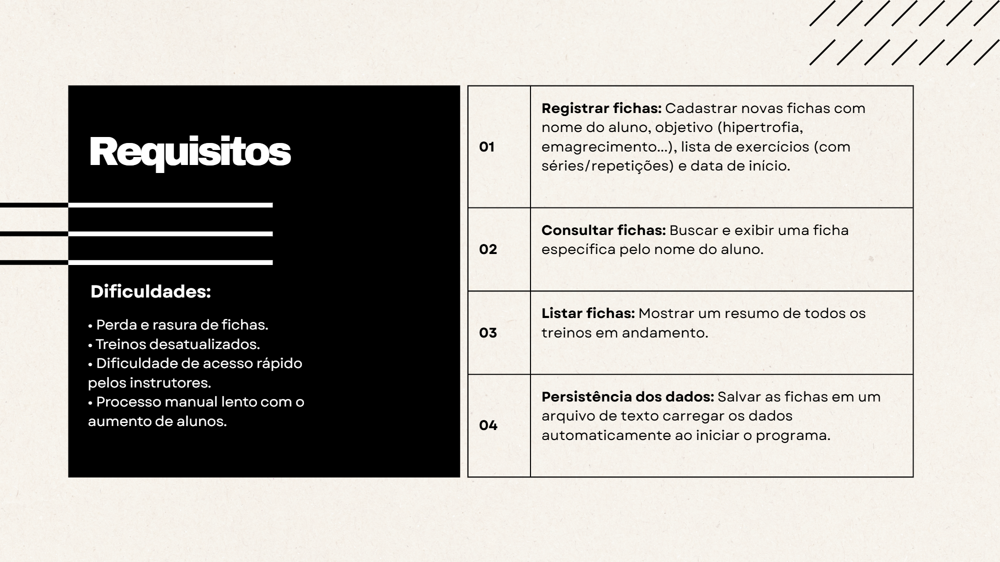

# Sistema de Fichas de Treino — Academia Corpo em Movimento

## Introdução


## GitHub dos Alunos
- [Taino Samuel](https://github.com/tainoxs)
- [Gabriel Ordonez](https://github.com/GahbX)
- [Rafael Oliveira](https://github.com/rafaelodsDEV)
- [Victor Eduard](https://github.com/vk-tor)

## Requisitos do Negócio


## Fluxograma da solução


## Pseudocódigo
[Pseudocódigo da solução](pseudocodigo.txt)

## Algoritmo desenvolvido
[Algoritmo desenvolvido](main.py)
  ```bash 
fichas = [] 
ARQUIVO_DADOS = "fichas.txt"
TREINOS = {
    "emagrecimento": [('Corrida', '30', 'min'), ('Polichinelos', '3', '30')],
    "hipertrofia": [('Supino', '4', '8'), ('Agachamento', '4', '10')],
    "resistencia": [('Pular Corda', '20', 'min'), ('Flexão', '3', 'max')]
}


def carregar_dados():
    """Carrega as fichas do arquivo de texto simples."""
    global fichas
    try:
        with open(ARQUIVO_DADOS, 'r') as f:
            for linha in f:
                fichas.append(linha.strip().split('|')) 
        print(f"Dados carregados! Total: {len(fichas)} fichas.")
    except FileNotFoundError:
        print("Arquivo não encontrado. Iniciando vazio.")
    except Exception:
        print("Erro ao ler dados.")

def salvar_dados():
    """Salva as fichas no arquivo de texto simples (Nome|Objetivo|Data)."""
    try:
        with open(ARQUIVO_DADOS, 'w') as f:
            for ficha in fichas:
                f.write("|".join(ficha) + "\n") 
        print("Dados salvos com sucesso!")
    except Exception:
        print("Erro ao salvar dados.")


def menu_principal():
    carregar_dados()

    while True:
        print("\n=== ACADEMIA CORPO EM MOVIMENTO ===")
        print("1. Cadastrar Novo Aluno")
        print("2. Consultar Ficha")
        print("3. Listar Todos os Alunos")
        print("4. Sair e Salvar Dados")
        
        opcao = input("Escolha uma opção (1-4): ").strip()

        if opcao == '1':
            nome = input("Nome do Aluno: ").strip()
    
            while True:
                obj = input(f"Objetivo ({', '.join(TREINOS.keys())}): ").strip().lower()
                if obj in TREINOS: 
                    break
                print("Objetivo inválido.")

            data = input("Data de Início: ").strip()
            
            fichas.append([nome, obj, data]) 
            print(f"Ficha de {nome} cadastrada.")

        elif opcao == '2':
            busca = input("Nome para buscar: ").strip().lower()
            encontrada = False
            
            for nome_aluno, obj_aluno, data_aluno in fichas:
                if nome_aluno.lower() == busca: 
                    print("\n--- FICHA ---")
                    print(f"Aluno: {nome_aluno}")
                    print(f"Objetivo: {obj_aluno.upper()}")
                    
                    treino = TREINOS.get(obj_aluno, [])
                    print("Exercícios:")
                    for nome_ex, series, reps in treino:
                        print(f"  -> {nome_ex} | {series} x {reps}")
                    
                    encontrada = True
                    break
            
            if not encontrada:
                print(f"Aluno '{busca}' não encontrado.")

        elif opcao == '3':
            if fichas:
                print("\n--- TODOS OS ALUNOS ---")
                for i, ficha in enumerate(fichas, 1):
                    print(f"{i}. {ficha[0]} - Objetivo: {ficha[1]}")
            else:
                print("Lista vazia.")

        elif opcao == '4': # SAIR E SALVAR
            salvar_dados()
            print("Programa encerrado.")
            break

        else:
            print("Opção não existe. Tente de 1 a 4.")
            
if __name__ == "__main__":
    menu_principal()
   ```

## Instalação e Configuração
1. Pré-requisitos:
   - `Python` 3.8 ou superior
   - Acesso de escrita/leitura ao diretório do projeto
2. Clonar/Copiar o projeto para sua máquina
3. Clonar/Copiar o projeto para sua máquina

## Como executar
1. No terminal, acesse a pasta do projeto
2. Rode:
   ```bash
   python main.py
   ```

   ou

   Execute o arquivo `main.exe` dentro da pasta exe

3. Interaja pelo menu apresentado:
   - `1` Cadastrar Novo Aluno
   - `2` Consultar Ficha
   - `3` Listar Todos os Alunos
   - `4` Sair e Salvar Dados

## Comprovação dos testes
Casos de teste manuais sugeridos para validar o sistema:
- Cadastro com objetivo válido: aluno é adicionado e aparece na listagem
- Cadastro com objetivo inválido: sistema solicita novamente até objetivo válido
- Consulta de aluno existente: exibe ficha com exercícios do objetivo
- Consulta de aluno inexistente: mensagem de "Aluno não encontrado"
- Listagem vazia: mensagem de "Lista vazia"
- Persistência: após `4` (Sair e Salvar), reiniciar o programa e verificar carregamento

## Sugestão de Melhorias


## Obrigado
- Obrigado por utilizar o sistema de fichas de treino.
- Sugestões e feedbacks são bem-vindos.